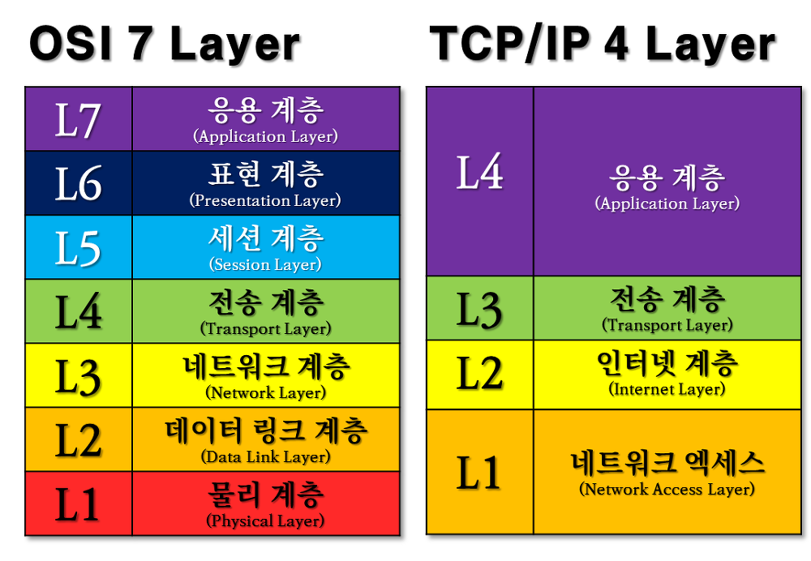

HTTP 기본을 공부하기에 앞서 기초적인 인터넷 네트워크의 개념을 정리한 포스트
  
## 1. IP
### 1. IP 인터넷 프로토콜의 역할
+ 지정한 IP 주소에 데이터를 전달한다.
+ 패킷(Packet)이라는 통신 단위로 데이터를 전달한다.
  + IP 패킷에는 출발지 IP, 목적지 IP, 전송 데이터가 포함되어 있다.
  + Package와 Bucket의 합성어.
+ 인터넷 망은 복잡하게 연결되어 있기 때문에 데이터를 주고 받을 때 경로가 틀려질 수 있다.

### 2. IP 프로토콜의 한계
+ 비연결성
  + 패킷을 받을 대상이 없거나 서비스 불능 상태여도 패킷을 전송 (목적지의 PC가 꺼져있거나 네트워크 연결이 끊겨도 전송한다.)
  + 클라이언트가 대상 서버가 패킷을 받을 수 있는 상태인지 모르는 경우
+ 비신뢰성
  + 전송 중에 패킷이 손실되어 사라질 수도 있다. (서버가 작동 불능 상태이거나 물리적인 요인에 의해 케이블이 끊어질 경우)
  + 여러 노드를 거치면서 패킷이 순서대로 오지 않을 수도 있다.
+ 프로그램 구분
  + 같은 IP를 사용하는 서버에서 통신하는 애플리케이션이 여러개라면? (한 PC에서 온라인으로 게임도 하고 음악 스트리밍도 하는 경우) 어떻게 구분 할 것인가.
  
## 2. TCP, UDP
이전 IP를 이용한 통신의 한계를 극복하기 위해 사용되는 프로토콜
+ 인터넷 프로토콜 스택의 4계층  
   
들어가기에 앞서 TCP/IP 4계층을 참고하자.  
  
TCP, UDP/IP는 OS 계층에 해당한다.  

### 1. TCP/IP 패킷 정보
+ 전송 제어 프로토콜
+ 기존 IP 패킷 안에 TCP 세그먼트가 함께 포함된다.
+ TCP 세그먼트에는 **출발지 포트, 목적지 포트, 전송 제어, 순서, 검증 정보 등**이 포함되어 있다.

### 2. TCP 특징
1. 연결지향: 서로 연결이 되어 있나 확인 후 전송한다. (TCP 3 way handshake)
2. 데이터 전달 보증: 데이터 전송 여부를 알 수 있다.
3. 순서 보장
+ 대부분의 애플리케이션에서 TCP를 사용한다.

### 3. TCP 3 way handshake란?
  

1. SYN(Synchronized) 이라는 메세지를 서버에 전송한다.
2. 서버에서 요청을 확인 했다는 의미의 ACK라는 메세지를 클라이언트 측에 SYN 메세지와 함께 전달한다.
3. 클라이언트도 서버의 메세지를 받았다면 다시 서버 측으로 확인 했다는 의미의 ACK 메세지를 서버 측에 보낸다.
+ 서로 대화하여 상태를 확인한다고 생각하자!
+ 서버에 문제가 생기면 서버 측에서 ACK 메세지를 보낼 수 없으므로 클라이언트 측에서 문제가 있음을 판단하여 데이터를 보내지 않는다.
+ 클라이언트 측에서 ACK를 보내면서 데이터를 함께 전송하는 경우도 많다.
+ 실제 물리적으로 연결 된 상태는 아니다.

### 4. UDP 특징
1. 기능이 거의 없다.
2. 3 way handshake도 데이터 전달 보증도 순서 보장도 하지 않는다.
3. 전달 보증을 위한 단계가 생략되므로 단순하고 빠르다.
+ 간단하게 말하자면 IP에서 PORT가 추가된 형태이다.
+ 애플리케이션에서 추가적인 작업 필요, 최적화에 유리하다.

## 3. PORT
+ 같은 IP 내에서 프로세스를 구분
+ 패킷 전송시 출발지 IP와 PORT를 구분해서 서버에 전송하기 때문에 반대로 서버에서 클라이언트로 응답을 줄 때 클라이언트에서 전송한 출발지 PORT를 목적지 PORT로 사용한다.
+ 0 ~ 65535 할당 가능
+ 0 ~ 1023: 잘 알려진 포트, 사용하지 않는 것이 좋다.  
   1. FTP - 20, 21
   2. TELNET - 23
   3. HTTP 기본 포트 - 80
   4. HTTPS 기본 포트 - 443

### 4. DNS
+ IP 주소는 기억하기 어려우며, 변경될 수 있는 단점이 있다.
+ 이를 극복하기 위해 DNS(Domain Name System)을 사용한다.
+ 전화번호부에 비유할 수 있다.
+ 도메인 명을 IP 주소로 변환한다.
+ DNS 서버에 도메인을 등록한다.