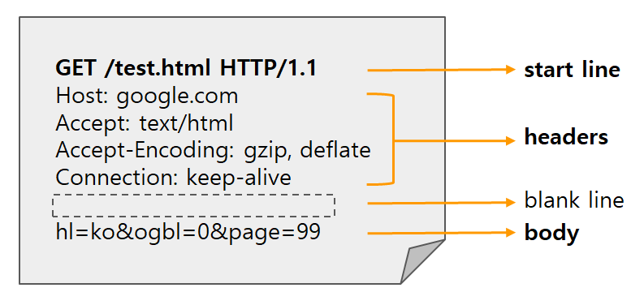

HTTP의 기본 개념에 대하여 정리한 포스트
  
## 1. HTTP(HyperText Transfer Protocol)
+ HTTP 메시지에 담아서 전송할 수 있는 데이터들은 다음과 같다
  1. HTML, TEXT 문서
  2. 이미지, 음성, 영상, 파일
  3. JSON, XML
  4. 서버간에 데이터를 주고 받을 때에도 대부분 HTTP 사용

+ 기반 프로토콜
  + TCP: HTTP/1.1, HTTP/2
  + UDP: HTTP/3
  + 현재는 주로 HTTP/1.1을 사용한다. 

+ HTTP의 특징
  + 클라이언트-서버 구조
  + 무상태 프로토콜(스테이트리스), 비연결성
  + HTTP 메시지
  + 단순함, 확장 가능

## 2. 클라이언트-서버 구조
+ Request Response 구조
+ 클라이언트가 요청을 보내고 서버가 응답을 한다.
+ 서버는 트래픽 수용을 위한 비즈니스 로직과 데이터에 집중을 하고 클라이언트는 UI, UX와 사용성에 집중한다.

## 3. 무상태 프로토콜
+ 서버가 클라이언트의 상태를 보존하지 않는다.
  + 장점: 서버 확장성이 높음
  + 단점: 클라이언트가 추가 데이터 전송

+ 상태 유지 - Stateful
  + 항상 같은 서버가 유지되어야 한다.
  + 특정 서버가 클라이언트A의 상태를 계속 가지고 있기 때문에 그 서버와만 통신을 해야한다.
  + 클라이언트A의 상태를 계속 가지고 있는 서버에 장애가 생기면 클라이언트A는 처음부터 다시 진행해야 한다.

+ 무상태 - Stateless
  + 서버가 클라이언트의 상태를 보존하지 않는다. 즉, 두 개의 요청 사이에는 연결고리가 없다.
  + 서버는 요청에 대한 처리만 할 뿐 클라이언트의 상태에 대하여 알 수 없다.
  + 클라이언트와 통신한 서버가 장애가 생겨도 다른 서버에서 응답을 줄 수 있다.

+ 무상태로 설계할 수 없는 경우는?
  + 상태 유지가 필요한 로그인 기능을 예로 들 수 있다.
  + 로그인 같은 경우 브라우저 쿠키와 서버 세션 등을 사용해서 상태를 유지한다.

+ 같은 시간에 동시에 몰리는 서비스를 개발 할 때는 대용량 트래픽에 대비해 최대한 무상태로 설계를 해야한다.

## 4. 비연결성
+ HTTP 통신에서 서버는 클라이언트의 요청에 대해 필요한 응답만 전송하고 연결을 끊기 때문에 연결을 유지할 필요가 없으며 최소한의 자원만 사용한다.
  + HTTP 통신은 기본은 연결을 유지하지 않는 모델
  + 일반적으로 초 단위 이하의 빠른 속도로 응답
  + 1시간 동안 수천명이 서비스를 사용해도 실제 서버에서 동시에 처리하는 요청은 수십개 이하로 매우 작음
  + 효율적인 리소스 사용
  
+ 자원 관리에 효율적인 비연결성 프로토콜이지만 한계점도 존재한다.
  + 다시 연결 할 때마다 TCP/IP 연결을 새로 맺어야 한다. (3way handshake 시간 추가)
  + 웹 브라우저로 사이트를 요청하면 HTML 뿐만 아니라 자바스크립트, CSS, 이미지 파일 등 수많은 자원이 함께 다운로드 된다. 자원을 다운로드 할 때마다 다시 연결을 새로 맺어야 한다.
  + 현재는 HTTP 지속 연결로 문제 해결
  + 지속 연결을 하면 각기 다른 자원을 다운로드 할 때마다 연결하고 끊는 것이 아닌 모든 자원의 요청, 응답이 끝날 때 까지 유지된다.

## 5. HTTP 메시지

+ HTTP 메서드
  + 종류: GET, POST, PUT, DELETE
  + 서버가 수행해야 할 동작 지정

+ 시작 라인
  + 응답 메시지
    + start-line = request-line / status-line
    + status-line = HTTP-version SP status-code SP reason-pharse CRLF
    + HTTP 상태 코드: 요청 성공, 실패를 나타냄
      1. 200: 성공
      2. 400: 클라이언트 요청 오류
      3. 500: 서버 내부 오류 
    + reason: 사람이 이해할 수 있는 상태 설명
+ HTTP 헤더
  + header-field = field-name ":" OWS field-value OWS (OWS: 띄어쓰기 허용)
  + field-name은 대소문자 구분이 없다.
  + 용도
    + HTTP 전송에 필요한 모든 부가정보가 포함 (body의 내용, 크기, 인증, 클라이언트 정보 등)

+ HTTP 바디
  + 용도
    + 실제 전송할 데이터
    + HTML, 이미지, 영상, 파일, JSON 데이터 등 byte로 표현할 수 있는 모든 데이터 전송 가능