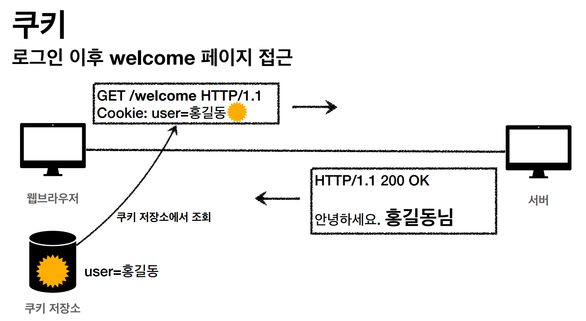

HTTP의 기본 개념에 대하여 정리한 포스트
  
## 1. HTTP 헤더의 개요
  + 헤더 분류 (과거의 RFC2616 표준)
    + General 헤더: 메시지 전체에 적용되는 정보
    + Request 헤더: 요청 정보
    + Response 헤더: 응답 정보
    + Entity 헤더: 엔티티 바디 정보 ex) Content-Type
  
  + RFC2616이 폐기되고 RFC723x가 되면서 생긴 변화?
    + Entity → 표현 (Respresentation)
    + 표현 메타데이터와 표현 데이터가 합쳐진 것

  + RFC723x 스펙의 HTTP BODY에서 표현이란?
    + 메시지 본문을 통해 표현 데이터 전달, 메시지 본문은 페이로드(payload)라고도 한다.
    + 표현은 요청이나 응답에서 전달할 실제 데이터
    + 표현 헤더는 표현 데이터를 해석할 수 있는 정보를 제공한다. (데이터 유형, 길이 등)

## 2. 표현
  + Content-Type: 표현 데이터의 형식
    + 미디어, 문자 인코딩 
  + Content-Encoding: 표현 데이터의 압축 방식
    + 표현 데이터, 리소스를 압축하기 위해 사용한다 ex)gzip, deflate 
    + 데이터를 전달하는 곳에서 압축 후 인코딩 헤더 추가
  + Content-Language: 표현 데이터의 자연 언어
  + Content-Length: 표현 데이터의 길이
    + 바이트 단위로 표현
    + Transfer-Encoding을 사용하면 사용하면 안 된다.

## 3. 협상
  + 클라이언트가 선호하는 표현 요청
  + user agent가 어떤 URI에 있는 리소스를 요청할 때, 해당 리소스가 사용자에게 적절한 형태로 받도록 정하게 해주는 방법
  + 요청 시에만 사용한다.
  + 콘텐츠를 어떤 형태로 받을지 협상한다로 이해하자.

### 1. 협상과 우선순위1 (Quality Values)
  + Quality Values(q) 값 사용
  + 0~1 범위, 클 수록 높은 우선순위를 갖는다.
  + q값 1은 생략할 수 있다.

### 2. 협상과 우선순위2 (Quality Values)
  + 구체적인 것이 우선한다.
  + Accept: text/*. text/plain, text/plain;format=flowed, \*/\*
    1. text/plain;format=flowed, \*/\*
    2. text/plain
    3. text/*
    4. \*/\*

### 3. 협상과 우선순위3 (Quality Values)
   + 구체적인 것을 기준으로 미디어 타입을 맞춘다.

## 4. 전송
  1. 단순 전송 (Content-Length)
  2. 압축 전송 (Content-Encoding)
  3. 분할 전송 (Transfer-Encoding)
      + 본문 데이터를 분할하여 전송한다.
      + 분할하여 전송하기 때문에 전체 길이를 처음부터 알 수 없다. 즉, Content-Length 헤더는 사용하지 않는다.
  4. 범위 전송 (Content-Range)
      + 클라이언트가 Range 헤더를 통해 데이터의 일부분을 요청하면 서버는 데이터에서   요청받은 범위를 전송하는 방법이다.
      + 데이터 용량을 아낄 때 좋을지도?

## 5. 일반 정보
  1. From
      + 유저 에이전트의 이메일 정보
      + 일반적으로 잘 사용되진 않지만 검색 엔진에서 주로 사용한다.
  2. Referer
      + 현재 요청된 페이지의 이전 웹 페이지 주소
      + 이를 이용해서 유입 경로를 분석할 수 있다.
      + Referer는 단어 Referrer의 오타이지만 오타 발견 전에 사용되어버려 그냥 놔두는 것
  3. User-Agent
      + 클라이언트 애플리케이션 정보 (웹 브라우저, OS 등)
      + 통계 정보로 어떤 브라우저에서 장애가 발생되는지 파악 가능
  4. Server
      + 요청을 처리하는 Origin 서버의 소프트웨어 정보
      + 표현 데이터를 만들어주는 서버 정보
      + 응답에서 사용
  5. Date
      + 메시지가 발생한 날짜와 시간

## 6. 특별한 정보
  1. Host
      + 요청한 호스트 정보(도메인)
      + 요청에서 사용
      + **필수**
      + 하나의 서버가 여러 도메인을 처리해야 할 때
      + 하나의 IP 주소에 여러 도메인이 적용되어 있을 때
  2. Location
      + 웹 브라우저는 3xx 응답의 결과에 Location 헤더가 있으면 Location 리소스 위치로 자동 리다이렉션 한다.
  3. Allow
      + 허용 가능한 HTTP 메서드
  4. Retry-After
      + 유저 에이전트가 다음 요청을 하기까지 기다려야 하는 시간
      + 503(Service Unavailable): 서비스가 언제까지 불능인지 알려줄 수 있다.
      + 날짜 또는 초단위로 표기 가능하다

## 7. 인증
  + Authorization: 클라이언트 인증 정보를 서버에 전달
  + WWW-Authenticate: 리소스 접근시 필요한 인증 방법을 정의

## 8. 쿠키
  + Set-Cookie: 서버에서 클라이언트로 쿠키 전달(응답)
  + Cookie: 클라이언트가 서버에서 받은 쿠키를 저장하고, HTTP 요청시 서버로 전달

### 1. 쿠키를 사용하지 않는다면?
  + HTTP 통신은 기본적으로 무상태 프로토콜이기 때문에 서버는 요청에 대해 응답을 주고나면 클라이언트와의 연결을 끊기 때문에 이후의 요청에 대해서도 요청한 사용자에 대한 정보를 알 수 없다. 대안으로 모든 요청과 링크에 사용자 정보를 포함시켜 서버에게 정보를 줄 수 있지만 보안 등 문제가 있다.

### 2. 쿠키의 사용
   

  + 요청 시 웹 브라우저가 쿠키 저장소에 저장된 정보를 쿠키 헤더에 담아 서버에 보낸다.

### 3. 쿠키의 특징
  + 주 사용처
    + 사용자 로그인 세션 관리
    + 광고 정보 트래킹
  + 쿠키 정보는 항상 서버에 전송됨
    + 네트워크 트래픽 추가 유발
    + 최소한의 정보만 사용 (세션 id, 인증 토큰)
  + 주의사항
    + 보안에 민감한 데이터는 쿠키로 저장하면 안 된다. (주민번호, 신용카드 정보 등등)

### 4. 쿠키의 생명주기
  + Set-Cookie: expires=Sat, 26-Dec-2020 04:30:00 GMT
    + 만료일이 되면 쿠키를 삭제한다.
  + Set-Cookie: max-age=3600 (초 단위)
    + 0이나 음수를 지정하면 쿠키 삭제
  + 세션 쿠키: 만료 날짜를 생략하면 브라우저 종료시 까지만 유지
  + 영속 쿠키: 만료 날짜를 입력하면 해당 날짜까지 유지

### 5. 쿠키 - 도메인
  + 아무 사이트에 무분별하게 쿠키를 보내면 문제가 되기 때문에 도메인을 지정한다.
  + 명시: 명시한 문서 기준 도메인 + 서브 도메인 포함
    + domain=example.com을 지정해서 쿠키를 생성
      + example.com과 하위 도메인인 dev.example.com도 쿠키 접근 
  + 생략: 현재 문서 기준 도메인만 적용
    + example.com에서 쿠키를 생성하고 domain 지정을 생략
      + example.com만 쿠키 접근이 가능하고 하위 도메인인 dev.example.com에는 쿠키 미접근

### 6. 쿠키 - 경로
  + 이 경로를 포함한 하위 경로 페이지만 쿠키에 접근한다.
  + path=/home
    + 이 경로를 포함한 하위 경로 페이지만 쿠키에 접근한다.
    + /home/depth1 → 가능
    + /hello → 불가능 

### 7. 쿠키 - 보안
  + Secure
    + 쿠키는 http, https를 구분하지 않고 전송한다.
    + Secure를 적용하면 https인 경우에만 전송한다.
  + HttpOnly
    + XSS 공격 방지 (권한이 없는 사용자가 악의적인 용도로 웹 사이트에 스크립트를 삽입하는 공격 기법)
    + 자바스크립트에서 접근할 수 없다.
    + HTTP 전송에만 사용한다.
  + SameSite
    + XSRF 공격 방지 (로그인된 사용자가 자신의 의지와 무관하게 공격자가 의도한 행위를 하게 만드는 공격, 악성 스크립트를 서버에 요청하는 방식)
    + 요청 도메인과 쿠키에 설정된 도메인이 같은 경우만 쿠키 전송