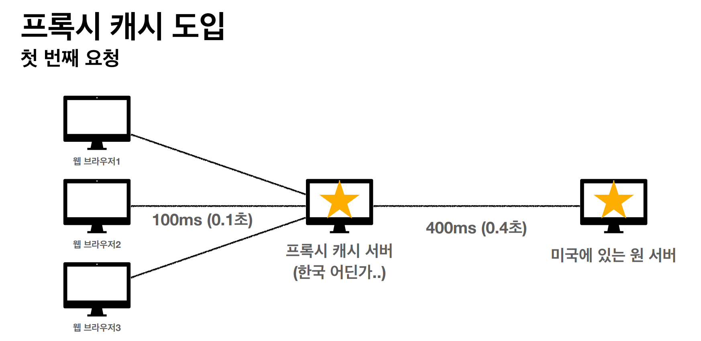

HTTP의 기본 개념에 대하여 정리한 포스트

## 1. 캐시의 기본 동작
  + 캐시가 없으면?
    + 데이터가 변경되지 않아도 계속 네트워크를 통해 데이터를 다운로드 받아야 한다.
    + 브라우저 로딩 속도가 느려진다.
  + 캐시 적용
    + 캐시 가능 시간동안 네트워크를 사용하지 않아도 된다.
    + 네트워크 사용량을 줄일 수 있다.
    + 네트워크가 아닌 브라우저 캐시 저장소에서 데이터를 가져오므로 브라우저 로딩 속도가   빠르다.
  + 캐시 시간 초과
    + 캐시 유효 시간이 초과하면, 서버를 통해 데이터를 다시 조회하고 갱신한다.
    + 이때 다시 네트워크 다운로드가 발생한다.

## 2. 검증 헤더와 조건부 요청1
  + 캐시 시간이 초과하면?
    + 서버에서 변경된 기존 데이터를 변경하거나 변경하지 않거나
  + 캐시 만료 후에도 서버에서 데이터를 변경하지 않았다면?
    + 클라이언트의 캐시 데이터와 서버의 데이터가 같다는 사실을 확인할 수 있는 방법이  필요하다. 그래서 검증 헤더라는 것이 필요하다.
  + 검증 헤더 추가
    + 캐시 유효 시간이 초과해도 서버의 데이터가 갱신되지 않으면 (최종 수정일 등) 304 Not  Modified 응답과 헤더 메타 정보만 응답한다. body는 보내지 않는다.
    + 클라이언트는 서버가 보낸 응답 헤더 정보로 캐시의 메타 정보를 갱신한다.
    + 이 응답으로 클라이언트는 캐시에 저장된 데이터를 재활용 하고 캐시 가능 시간을 갱신

## 3. 검증 헤더와 조건부 요청2
  + 검증 헤더
    + 캐시 데이터와 서버 데이터가 같은지 검증하는 데이터
    + last-modified, ETag
  + 조건부 요청 헤더
    + 검증 헤더로 조건에 따른 분기
    + If-Modified-Since: last-modified 사용
    + If-None-Match: ETag 사용
    + 조건이 만족하면 200 OK
    + 조건이 만족하지 않으면 304 Not Modified
  + last-modified와 If-Modified-Since의 단점?
    + 1초 미만 단위로 캐시 조정을 할 수 없다.
    + 날짜 기반의 로직 사용
    + 데이터를 수정해서 날짜가 다르지만, 데이터 결과가 똑같은 경우
    + 서버에서 별도의 캐시 로직을 관리하고 싶은 경우
  + ETag란?
    + 캐시용 데이터에 날짜가 아닌 임의의 버전 이름을 달아준다.
    + 버전을 비교해서 같으면 캐시 사용 아니면 다시 다운로드
  + ETag, If-None-Match
    + 캐시 제어 로직을 서버에서 완전히 관리
    + 클라이언트는 단순히 이 값을 서버에 제공

### 4. 캐시와 조건부 요청 헤더
  + 캐시 제어 헤더
    1. Cache-Control (캐시 지시어)
        + Cache-Control: max-age
            + 캐시 유효시간, 초 단위
        + Cache-Control: no-cache
            + 데이터는 캐시해도 되지만, 항상 origin 서버에 검증하고 사용
        + Cache-Control: no-store
            + 데이터에 민감한 정보가 있으므로 캐시로 저장하면 안 됨
     2. Pragma (캐시 제어)
        + Pragma: no-cache
        + HTTP 1.0 하위호환
     3. Expires (캐시 만료일 지정)
        + 캐시 만료일을 정확한 날짜로 지정
        + HTTP 1.0 부터 사용
        + 지금은 더 유연한 Cache-Control: max-age 권장

### 5. 프록시 캐시
   

  + 위 그림 처럼 원(origin) 서버와 직접 통신하는 것이 아닌 가까운 곳에 프록시 캐시 서버를 두고 클라이언트가 통신을 할 때는 프록시 캐시 서버를 통해 데이터를 다운로드 받는다 원 서버는 프록시 캐시 서버에 미리 저장을 해둔다.
  + 보통 CDN(AWS, 클라우드플레어 등)이 프록시 캐시 서버 역할을 겸한다.

### 6. 캐시 무효화
  + 캐시 적용을 하지 않아도 웹 브라우저는 임의로 캐시를 하는 경우가 있기 때문에 캐시 하면 안 되는 정보의 경우 확실한 캐시 무효화 응답이 필요하다.
  + Cache-Control (캐시 지시어)
    + Cache-Control: no-cache
      + 데이터는 캐시해도 되지만, 항상 origin 서버에 검증하고 사용
    + Cache-Control: no-store
        + 데이터에 민감한 정보가 있으므로 캐시로 저장하면 안 됨
    + Cache-Control: must-revalidate
        + 캐시 만료 후 최초 조회시 origin 서버에 검증해야 함
        + origin 서버 접근 실패시 반드시 오류가 발생하여아 함 - 504(Gatewat Timeout)